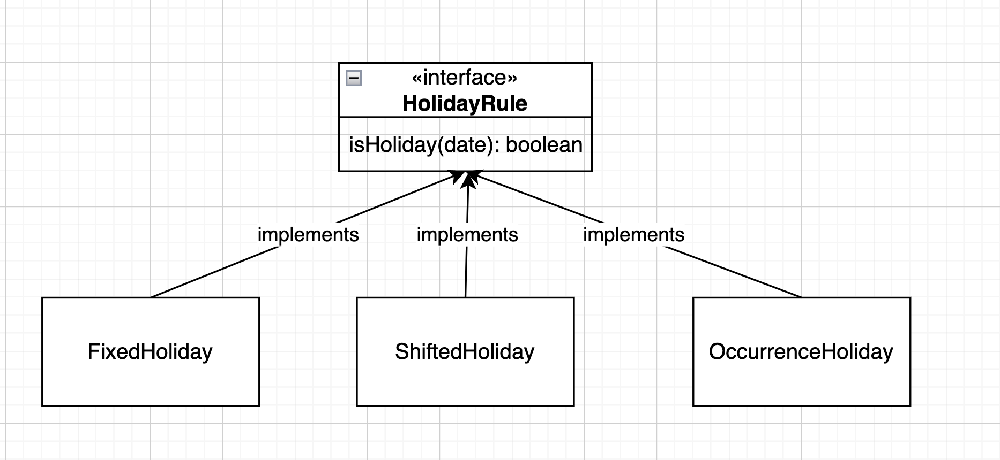

# Business Day Counter

This project is a TypeScript implementation to calculate business days between two dates. The implementation includes logic to consider weekends and different types of holidays using a flexible and extendable design.

## Requirements

- Node.js version: `>= 18`

## Setup

To set up the project:

1. Clone the repository.
2. Install dependencies by running:

   ```bash
   npm install
   ```

## Folder Structure

```bash
business-day-counter/
│
├── task-1-and-2/          # Implementation and tests for counting business days without holiday rules
├── task-3/                # Extended implementation with holiday rules
│   ├── holiday-rules/     # Different types of holiday rules (fixed, shifted, occurrence)
├── .gitignore
├── jest.config.js
├── package-lock.json
├── package.json
├── README.md
└── tsconfig.json
```

## Running Tests

To run the tests:

```bash
npm run test
```

## Example Usage

```typescript
import { BusinessDayCounter } from "./task-3/business-day-counter";
import { FixedHoliday } from "./task-3/holiday-rules/fixed-holiday";

const counter = new BusinessDayCounter();
const firstDate = new Date("2023-12-20"); // Wednesday
const secondDate = new Date("2023-12-29"); // Friday
const holidays = [new FixedHoliday(25, 11)]; // December 25th
console.log(
  counter.BusinessDaysBetweenTwoDates(firstDate, secondDate, holidays)
); // 5 is printed
```

## Approach

### Test Driven Development (TDD)

The project uses a Test Driven Development (TDD) approach. TDD helps ensure that all code is well-tested and that the business logic behaves as expected. Writing tests before implementing the logic also allows us to better understand the requirements and helps reduce errors.

### Why date-fns?

We used the date-fns library because it is a well-maintained and highly reliable library for handling date operations in JavaScript and TypeScript. Using a well-supported library helps us avoid reinventing the wheel and over-engineering our solution. It also makes the code more readable and maintainable, while taking advantage of community-tested solutions for handling date manipulations.

## Task 3 Explanation

### Why Use HolidayRule Interface?

The HolidayRule interface allows us to have a unified way of representing holidays. It makes the implementation easily extendable. If we need to add another type of holiday (e.g., custom or country-specific rules), we just need to create a new class that implements the HolidayRule interface. This makes our code more modular, reusable, and open to extension while maintaining a simple and consistent structure.

## Holiday Rules Diagram

Below is a diagram that illustrates the different holiday rules implemented in this project:



### Class Explanation

**FixedHoliday:**

Represents holidays that always occur on a fixed date each year (e.g., Christmas on December 25th).

**ShiftedHoliday:**

Represents holidays that need to be observed on different days if they fall on a weekend. For example, if New Year's Day falls on a Sunday, it is observed on the following Monday.

**OccurrenceHoliday:**

Represents holidays that occur on a specific occurrence of a weekday in a month (e.g., the second Monday of June).

## Summary

This project follows a modular and extensible approach by leveraging the power of interfaces, TDD, and well-tested third-party libraries like date-fns. Each type of holiday is implemented as a separate class to maintain flexibility, and we adopted TDD to ensure robust and reliable code from the start.
